# 📖 Diário de Estudos Bíblicos + IA

Aplicativo Flutter integrado com Firebase e IA, desenvolvido como projeto final para a disciplina de Programação II. O app permite ao usuário navegar pelos livros da Bíblia, gerar estudos personalizados com auxílio de IA (ChatGPT) e salvar seus estudos na nuvem (Firebase Firestore).

---

## 🎯 Objetivo

Facilitar o estudo bíblico de forma moderna, interativa e acessível, permitindo que o usuário:

- Acesse a Bíblia completa
- Gere estudos com base em versículos
- Visualize contexto histórico, aplicação prática e referências cruzadas
- Salve e gerencie seus estudos no Firebase

---

## 🚀 Tecnologias Utilizadas

- *Flutter* (Dart)
- *Firebase Authentication*
- *Firebase Firestore*
- *Firebase Core*
- *Flutter GetX* (Gerenciamento de estado e rotas)
- *flutter_dotenv* (configurações sensíveis)
- *WebView Flutter* (para abrir links externos)
- *API externa Bíblia4U* (https://bible4u.net/api/v1/pt)
- *OpenAI ChatGPT API* (para gerar estudos)

---

## 📱 Funcionalidades Principais

| Funcionalidade                        | Status  |
|--------------------------------------|---------|
| Login e Cadastro com Firebase        | ✅      |
| Recuperação de senha                 | ✅      |
| Listagem de livros da Bíblia         | ✅      |
| Navegação por capítulos e versículos | ✅      |
| Geração de estudo com IA             | ✅      |
| Visualização formatada do estudo     | ✅      |
| Link externo para estudo adicional   | ✅      |
| Salvamento de estudos na nuvem       | ✅      |
| Biblioteca de estudos salvos         | ✅      |

---

## Capturas de Tela 

###  Tela de login
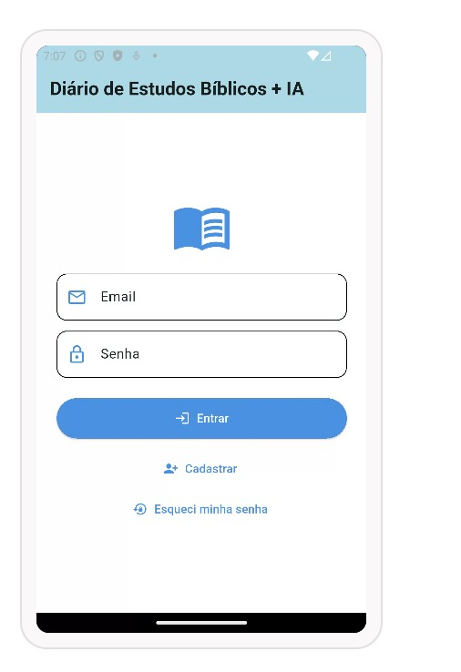

### 🔐 login
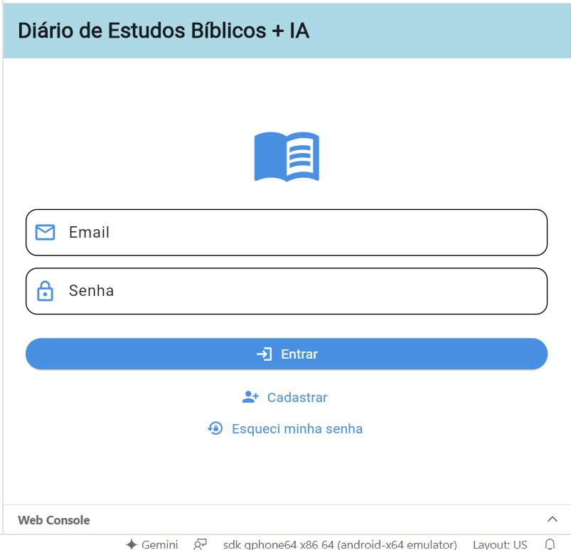

### 🔐 Recuperação de Senha
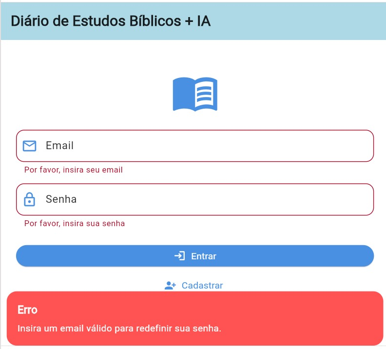

### 🧾 livros da Biblia
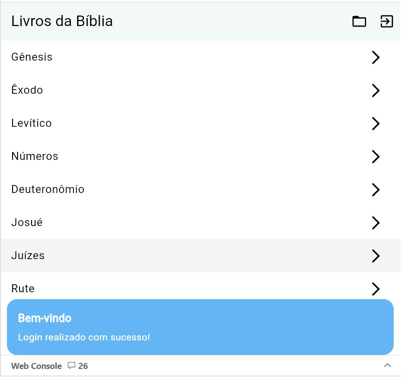

### 📘 Exibição de Capítulo (ex: Gênesis 1)
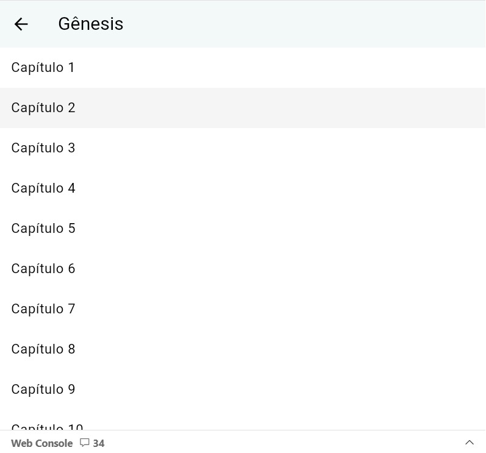

### 📘 Exibição de Capítulo (ex: Gênesis 1)
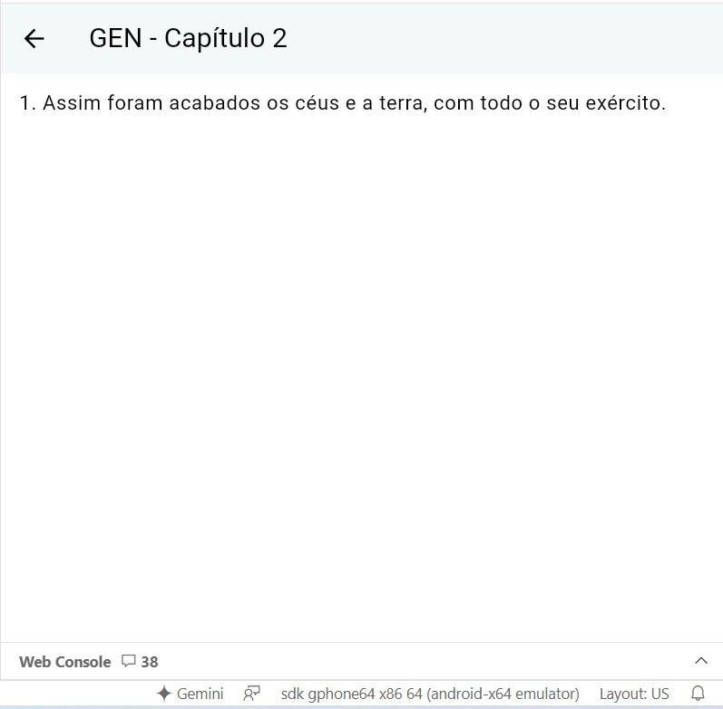

### 📖 Tela de Estudo com IA
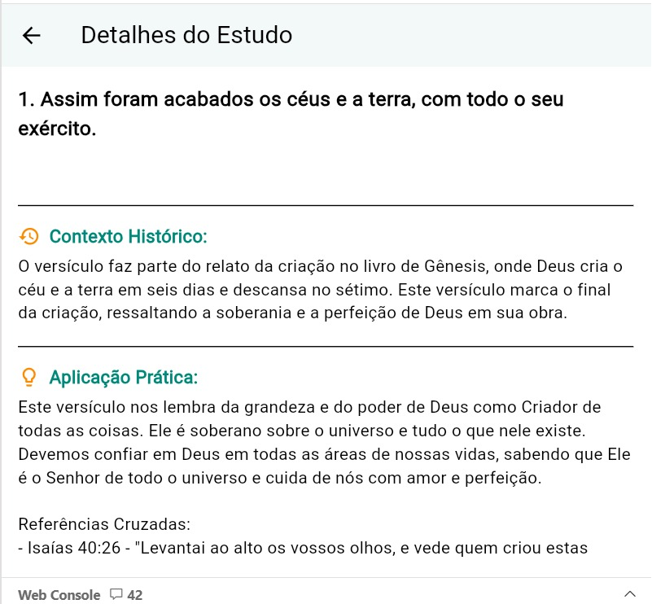

### 🧾 Detalhes do Estudo
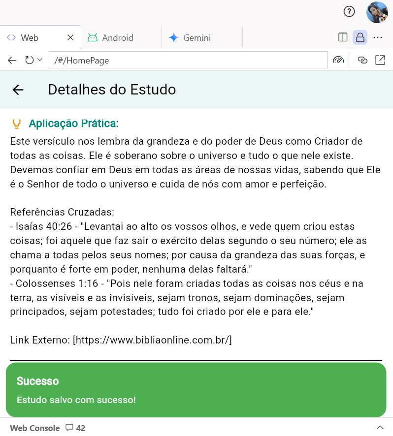

### 🧾 Detalhes do Estudo
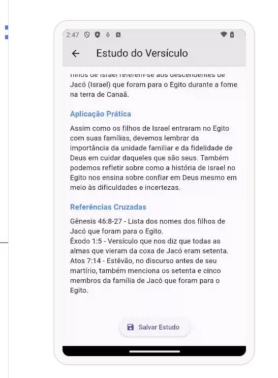

### 💾 Biblioteca de Estudos Salvos
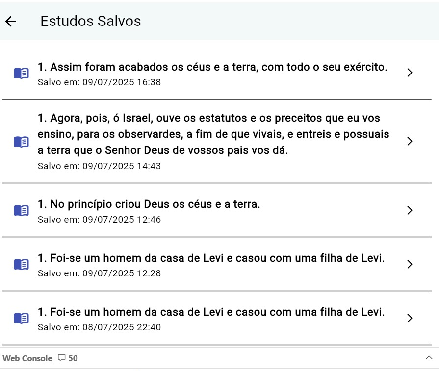

### 📘 Exibição de Capítulo (ex: Gênesis 1)

### 🔗 Link Externo
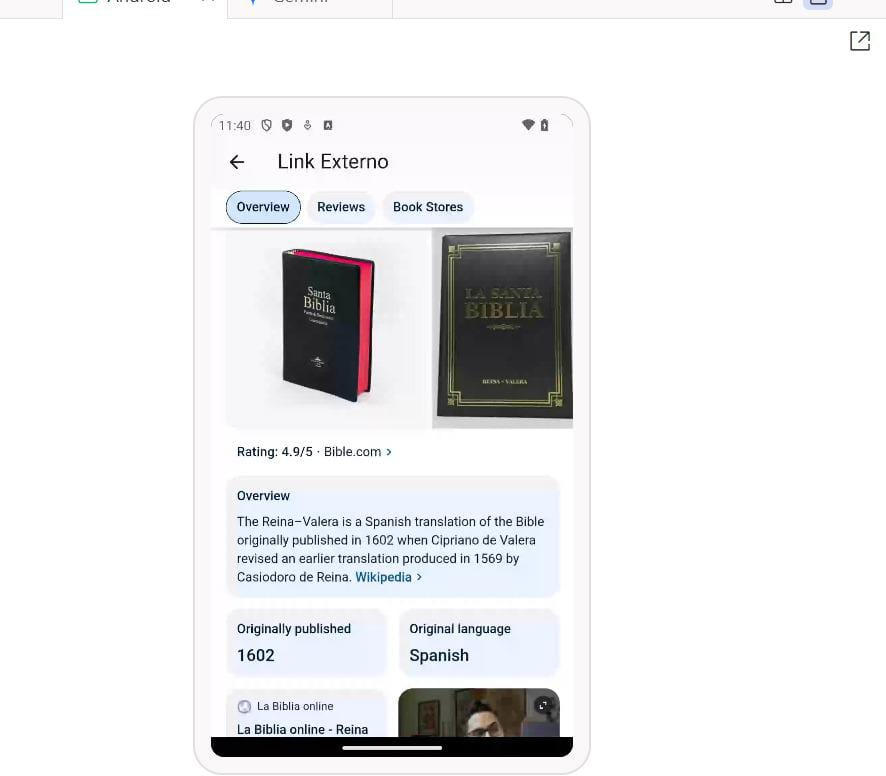

## Autor 

git clone https://github.com/julianadesouzamartins/final_atvMobile.git
